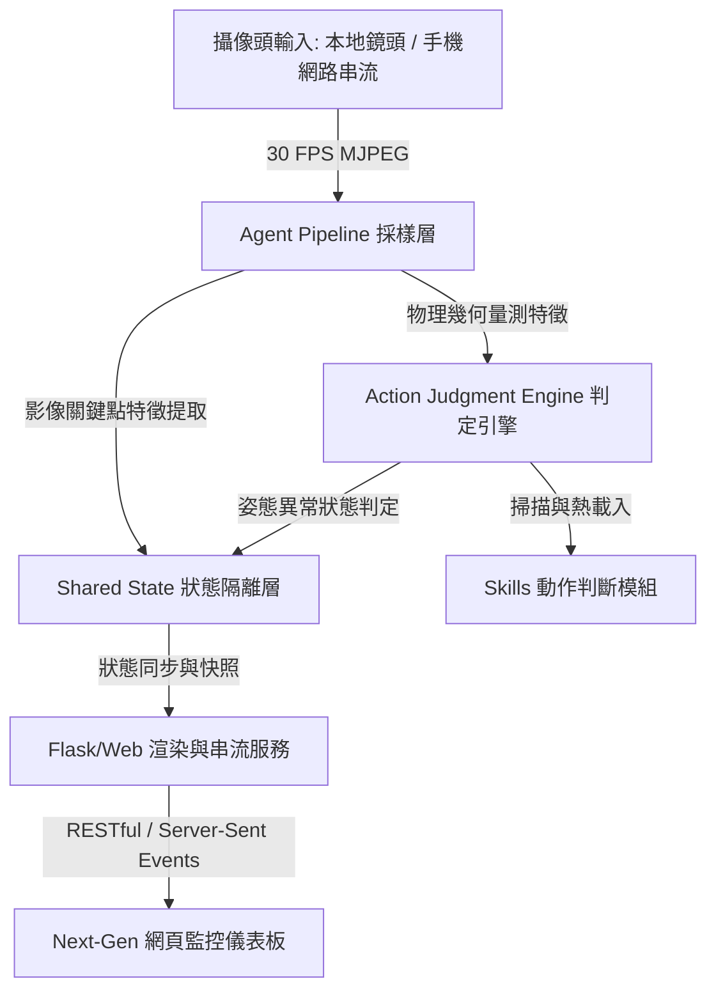
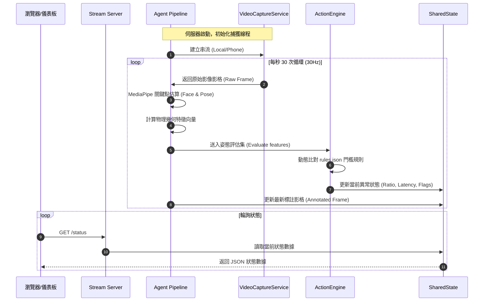

# RenUniversal 次世代智慧姿態監控代理系統：精確技術規範與架構說明

本文件提供 RenUniversal 專案的系統拓撲、核心演算法以及動態規則引擎的完整技術導覽，適用於系統架駕者與研發人員。

---

## 1. 系統拓撲與資料流 (System Topology)

RenUniversal 採用單向數據流與邊緣運算設計，整體系統由以下三個核心層級構成：



### 1.1 執行生命週期 (Lifecycle Sequence)



---

## 2. 幾何演算法與物理特徵提取 (Feature Extraction & Math Formulas)

核心幾何計算由 `backend/core/pipeline.py` 完成。系統提取以下特徵向量以判定坐姿健康度：

### 2.1 低頭比例 (Nose-Chin Ratio)
低頭判定基於 3D 面部網格在投影面上的長度變化。當頭部前傾時，鼻尖（Landmark 4）與下巴底端（Landmark 152）在影像上的垂直距離會縮短：
$$\Delta d_{\text{nose-chin}} = y_{\text{chin}} - y_{\text{nose}}$$
$$\text{Ratio} = \frac{\Delta d_{\text{nose-chin}} - d_{\text{baseline}}}{d_{\text{baseline}}}$$
*   **物理特性**：低頭時比率為負值（如 $-0.20$ 代表相較基準縮短了 20%）。

### 2.2 軀幹搖晃比 (Torso Sway)
軀幹的水平偏移以肩膀中點相對於影像寬度的偏離值來衡量。設左右肩膀頂點分別為 $S_L$ 與 $S_R$，其中心點為 $C_S = \frac{S_L + S_R}{2}$：
$$\text{Sway} = \frac{|x_{C_S} - x_{\text{baseline}}|}{W_{\text{frame}}}$$
*   **物理特性**：值恆大於或等於 0，偏離基準越遠數值越高。

### 2.3 軀幹前傾比 (Torso Lean)
軀幹前傾程度藉由雙肩中點與雙髖中點在垂直軸上的相對縮減比率來推估：
$$\text{Torso Length} = y_{\text{hips}} - y_{\text{shoulders}}$$
$$\text{Lean} = \frac{\text{Torso Length}_{\text{baseline}} - \text{Torso Length}}{\text{Torso Length}_{\text{baseline}}}$$

### 2.4 肩部傾斜度 (Shoulder Slope)
肩膀的倾角（Roll）透過計算雙肩連線斜率得出：
$$\text{Slope} = \frac{y_{S_R} - y_{S_L}}{x_{S_R} - x_{S_L}}$$

---

## 3. 動態規則引擎 (Dynamic Action Judgment Engine)

### 3.1 插件式掃描與熱載入機制
`backend/core/action_engine.py` 提供一個動態插件載入器，能夠在免重啟服務的前提下重載判定規則：
*   **掃描路徑**：`skills/` 目錄。
*   **判斷包結構**：
    ```text
    skills/custom_action/
    ├── config.json  # 宣告特徵匹配規則與預設門檻
    └── logic.py     # 統一複製自 core/skill_template.py 的通用解析邏輯
    ```

### 3.2 規則 Schema 與比較操作
`config.json` 定義了條件規則鏈：
```json
{
  "name": "shoulder_tilt",
  "description": "肩部倾斜度檢測",
  "enabled": true,
  "requirements": {
    "face_mesh": false,
    "pose": true
  },
  "rules": [
    {
      "feature": "shoulder_slope",
      "operator": ">",
      "threshold_key": "shoulder_tilt_threshold"
    }
  ],
  "default_preferences": {
    "shoulder_tilt_threshold": 0.15
  }
}
```
*   **支援特徵字串**：`nose_chin_ratio`, `torso_sway`, `torso_lean`, `shoulder_slope`, `yaw_deviation`。
*   **比較運算元**：`>`, `<`, `>=`, `<=`, `==`。

---

## 4. 代碼映射與設計模式 (Implementation Map)

| 原始碼檔案 | 責任範疇 | 使用之設計模式 (Design Pattern) |
| :--- | :--- | :--- |
| [pipeline.py](file:///Users/shihte.hsiao/Downloads/RenUniversal/backend/core/pipeline.py) | 核心流水線驅動、MediaPipe 控制、影像特徵提取 | **Pipeline Pattern** (管線模式), **Facade** (外觀模式) |
| [action_engine.py](file:///Users/shihte.hsiao/Downloads/RenUniversal/backend/core/action_engine.py) | 動態發現與載入 `/skills/` 底下所有動作判斷包 | **Plugin Pattern** (插件模式), **Registry** (註冊表) |
| [state.py](file:///Users/shihte.hsiao/Downloads/RenUniversal/backend/core/state.py) | 線程安全的狀態同步、配置持久化讀寫 | **State Pattern** (狀態模式), **Singleton-like Context** |
| [video_capture/logic.py](file:///Users/shihte.hsiao/Downloads/RenUniversal/backend/services/video_capture/logic.py) | 影像讀取硬體封裝、多執行緒緩衝、自動防禦重連 | **Wrapper Pattern** (包裝器), **Active Object** |
| [calibration_wizard/logic.py](file:///Users/shihte.hsiao/Downloads/RenUniversal/backend/services/calibration_wizard/logic.py) | 提供基準值平均採樣邏輯，將常態值寫回狀態 | **Inversion of Control** (控制反轉) |

---

## 5. 開發者偵錯與驗證 (Verification Guide)

### 5.1 測試套件執行
我們提供架構合規性測試：
```bash
make test
```
該指令會觸發 `backend/test_architecture.py`，驗證當前核心 Skill 組件是否正確實作 Typed I/O 與 Pydantic 結構定義。
