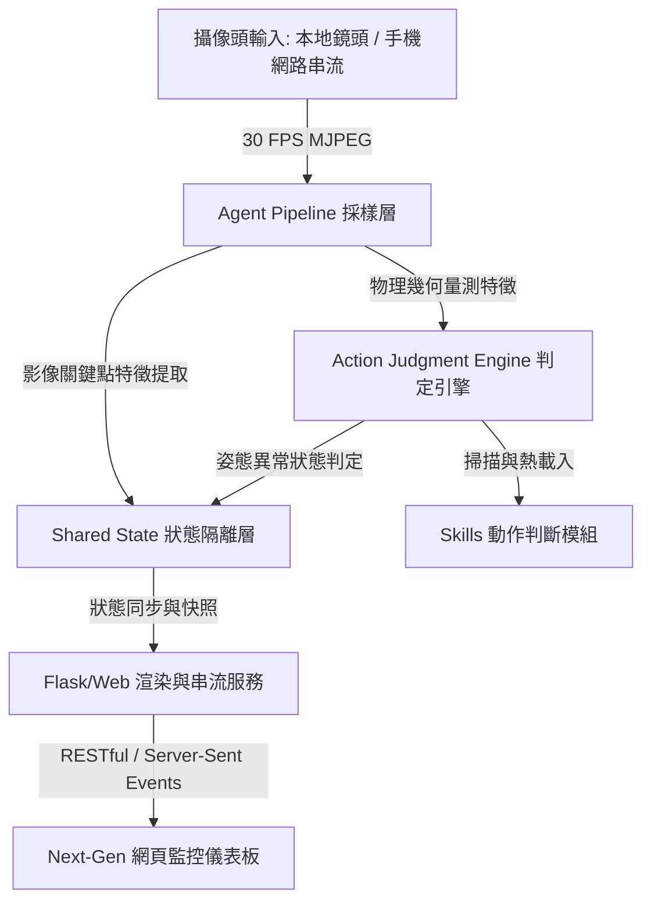
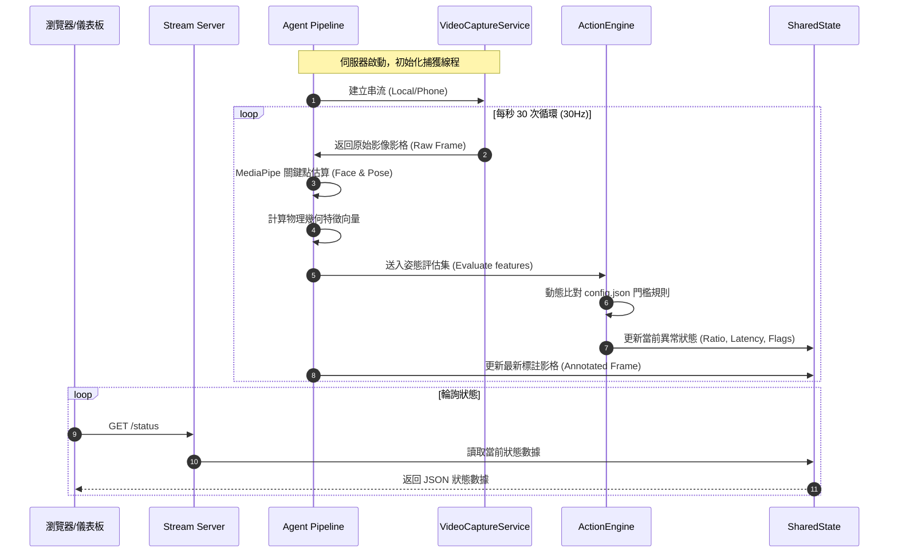

# 🏛 系統架構與演算法 (Architecture & Algorithms)

本文件提供 RenUniversal 專案的系統拓撲、核心演算法以及動態規則引擎的完整技術導覽，適用於系統架構者與研發人員。

> 回到 [文件中心](README.md)

---

## 1. 系統拓撲與資料流 (System Topology)

RenUniversal 採用單向數據流與邊緣運算設計，整體系統由以下三個核心層級構成：

```mermaid
graph TD
    A[攝像頭輸入: 本地鏡頭 / 手機網路串流] -->|30 FPS MJPEG| B[Agent Pipeline 採樣層]
    B -->|影像關鍵點特徵提取| C[Shared State 狀態隔離層]
    B -->|物理幾何量測特徵| D[Action Judgment Engine 判定引擎]
    D -->|掃描與熱載入| E[Skills 動作判斷模組]
    D -->|姿態異常狀態判定| C
    C -->|狀態同步與快照| F[Flask/Web 渲染與串流服務]
    F -->|RESTful / Server-Sent Events| G[Next-Gen 網頁監控儀表板]
```

### 1.1 執行生命週期 (Lifecycle Sequence)

```mermaid
sequenceDiagram
    autonumber
    participant Client as 瀏覽器/儀表板
    participant Server as Stream Server
    participant Pipeline as Agent Pipeline
    participant Camera as VideoCaptureService
    participant Engine as ActionEngine
    participant State as SharedState

    Note over Pipeline, Camera: 伺服器啟動，初始化捕獲線程
    Pipeline->>Camera: 建立串流 (Local/Phone)
    loop 每秒 30 次循環 (30Hz)
        Camera->>Pipeline: 返回原始影像影格 (Raw Frame)
        Pipeline->>Pipeline: MediaPipe 關鍵點估算 (Face & Pose)
        Pipeline->>Pipeline: 計算物理幾何特徵向量
        Pipeline->>Engine: 送入姿態評估集 (Evaluate features)
        Engine->>Engine: 動態比對 config.json 門檻規則
        Engine->>State: 更新當前異常狀態 (Ratio, Latency, Flags)
        Pipeline->>State: 更新最新標註影格 (Annotated Frame)
    end

    loop 輪詢狀態
        Client->>Server: GET /status
        Server->>State: 讀取當前狀態數據
        State-->>Client: 返回 JSON 狀態數據
    end
```

---

## 2. 幾何演算法與物理特徵提取 (Feature Extraction & Math Formulas)

核心幾何計算由 `backend/core/pipeline.py` 完成。系統提取以下特徵向量以判定坐姿健康度：

### 2.1 低頭比例 (Nose-Chin Ratio)
低頭判定基於 3D 面部網格在投影面上的長度變化。當頭部前傾時，鼻尖（Landmark 1）與下巴底端（Landmark 152）在影像上的垂直距離會縮短：
$$\Delta d_{\text{nose-chin}} = y_{\text{chin}} - y_{\text{nose}}$$
$$\text{Ratio} = \frac{\Delta d_{\text{nose-chin}} - d_{\text{baseline}}}{d_{\text{baseline}}}$$
*   **物理特性**：低頭時比率為負值（如 $-0.20$ 代表相較基準縮短了 20%）。

### 2.2 軀幹搖晃比 (Torso Sway)
軀幹的水平偏移以肩膀中點相對於影像寬度的偏離值來衡量。設左右肩膀頂點分別為 $S_L$ 與 $S_R$，其中心點為 $C_S = \frac{S_L + S_R}{2}$：
$$\text{Sway} = \frac{|x_{C_S} - x_{\text{baseline}}|}{W_{\text{frame}}}$$
*   **物理特性**：值恆大於或等於 0，偏離基準越遠數值越高。

### 2.3 軀幹前傾比 (Torso Lean)
軀幹前傾程度藉由雙肩中點與雙髖中點在垂直軸上的相對縮減比率來推估：
$$\text{Torso Length} = y_{\text{hips}} - y_{\text{shoulders}}$$
$$\text{Lean} = \frac{\text{Torso Length}_{\text{baseline}} - \text{Torso Length}}{\text{Torso Length}_{\text{baseline}}}$$

### 2.4 肩部傾斜度 (Shoulder Slope)
肩膀的倾角（Roll）透過計算雙肩連線斜率得出：
$$\text{Slope} = \frac{y_{S_R} - y_{S_L}}{x_{S_R} - x_{S_L}}$$

---

## 3. 動態規則引擎與視覺化幾何判定 (Action Engine & Geometric Rules)

### 3.1 插件式掃描與熱載入 (Python Backend)
Python 伺服器端提供一個動態插件載入器（[`action_engine.py`](../backend/core/action_engine.py)），能夠在免重啟服務的前提下重載判定規則：
*   **掃描路徑**：`skills/` 目錄。
*   **無程式碼路徑**：技能僅含 `config.json` 時，由 `GenericActionDetector` 以幾何點位語法（`f<n>,p<n>` + 運算子）判定。
*   **進階程式碼路徑**：技能附帶 `logic.py` 時，可使用內建特徵字串 `nose_chin_ratio`, `torso_sway`, `torso_lean`, `shoulder_slope`, `yaw_deviation`（由 [`skill_template.py`](../backend/core/skill_template.py) 預計算）。
*   完整規則語法見 [規則語法參考](rule-engine.md)。

### 3.2 視覺化拓樸選點與物理層級判定 (iOS Native)
iOS 原生端拋棄了傳統的命名變數，採用全新的**「視覺化特徵對應 (Visual Topology Point Selection)」**與**「螢幕物理對齊」**：
*   **點位宣告**：使用者透過雙指縮放，直接從 500+ 個面部與身體節點中指定任意兩點 (如 `p11`, `p12` 雙肩，或 `f4`, `f152` 鼻尖下巴)。
*   **物理空間精準計算**：`RuleEngine.swift` 會將特徵的 Normalized 座標轉換為符合手機螢幕長寬比的物理像素幾何距離，避免因設備比例差異造成的橢圓誤差。

### 3.3 新世代幾何運算元 (Next-Gen Operators)
無論是 iOS 或 Web 介面，新版引擎支援以下高級幾何運算，直接處理點與點之間的空間變化（權威定義見 [規則語法參考](rule-engine.md)）：
*   **縮短 (`><`)**：當前兩點距離較校準基準縮小達指定比例時觸發。
*   **放大 (`<>`)**：當前兩點距離較校準基準放大達指定比例時觸發。
*   **變化 (`>><<`)**：當前距離與基準的偏差絕對值達指定比例時觸發（不分變長或變短）。
*   **越界 (`~~`)**：**雙獨立球體越界檢測**。系統不以線段長度判斷，而是記住兩點在校準時的「絕對空間座標」，並以該座標為中心畫出物理級別的正圓形防護網。只要任一端點飄出自己的防護圈即觸發，完美解決代償動作（例如頭沒歪、但整個身體平移）的防守死角。

> 子條件之間可用 `AND` / `OR` / `NOT`（或 `!`）與括號組合，最終由 AST 白名單布林求值器安全計算，詳見 [隱私保護與資安](privacy-and-security.md)。

---

## 4. 代碼映射與設計模式 (Implementation Map)

### 4.1 Python Backend 核心組件
| 原始碼檔案 | 責任範疇 | 使用之設計模式 |
| :--- | :--- | :--- |
| `backend/core/pipeline.py` | 核心流水線驅動、影像特徵提取、臉部隱私打碼 | **Pipeline Pattern** |
| `backend/core/action_engine.py`| 動態發現與載入 `/skills/` 動作包 | **Plugin Pattern** |
| `backend/core/event_engine.py` | 將技能狀態以邏輯規則組合成複合事件 | **Interpreter Pattern** |
| `backend/core/state.py` | 線程安全的狀態同步、網路來源驅逐、持久化讀寫 | **State Pattern** |
| `backend/core/safe_eval.py` | AST 白名單布林求值，取代不安全的 `eval` | **Guard / Whitelist** |

### 4.2 iOS Native 核心組件 (Swift)
| 原始碼檔案 | 責任範疇 | 使用之設計模式 |
| :--- | :--- | :--- |
| `MediaPipeService.swift` | 封裝 Google MediaPipe Tasks Vision C++ | **Adapter Pattern** |
| `RuleEngine.swift` | 處理 `~~`, `><` 等進階空間幾何運算與長寬比修正 | **Strategy Pattern** |
| `OverlayView.swift` | 根據幾何引擎結果，即時繪製完美的紅色/綠色防護圈與連線 | **Observer Pattern** |
| `PointReferenceView.swift` | 視覺化拓樸點位雙指縮放與拖曳選擇器 | **Interactive View Component** |

---

## 5. 設計模式總覽 (Design Patterns Recap)

RenUniversal 的可維護性建立在清晰的關注點分離上：

| 模式 | 體現位置 | 解決的問題 |
| :--- | :--- | :--- |
| **Pipeline** | `pipeline.py` | 將「擷取 → 特徵提取 → 判定 → 事件 → 可視化」串成單向資料流 |
| **Plugin / Reflection** | `action_engine.py` | 免重編譯，運行時動態載入 `skills/` 判斷包 |
| **State Isolation** | `state.py` | 以鎖保護的共享狀態，安全跨線程同步並持久化 |
| **Strongly Typed I/O** | `schema.py` | 以 Pydantic 模型約束狀態與請求結構 |
| **Safe Evaluation** | `safe_eval.py` | 以 AST 白名單取代 `eval`，杜絕規則注入 |

> 啟動與運行指令請見 [安裝與快速啟動](getting-started.md)；對外部署的安全注意事項見 [隱私保護與資安](privacy-and-security.md)。

---

## 6. 深入實作 (Internals)

本文件為高層概覽；若要深入單一模組的內部流程與生命週期，請見 **[進階技術細節 (Internals)](internals/README.md)**：

- [Agent Pipeline 實作與生命週期](internals/pipeline.md) — `run_cycle()` 流程圖、多鏡頭融合、效能特性
- [狀態管理與並行模型](internals/state-and-concurrency.md) — 執行緒拓撲、三把鎖、來源驅逐
- [規則求值內部流程](internals/rule-evaluation.md) — 轉換管線、幾何判定、AST 安全求值
- [HTTP API 與請求生命週期](internals/http-api.md) — 認證守門、端點清單、輸入防護
