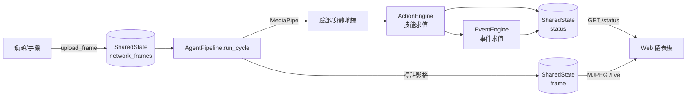

# 🔬 進階技術細節 (Internals)

本區提供 RenUniversal 後端的**深入實作文件**，逐一拆解核心模組的內部運作、生命週期與資料流。適合要修改核心、除錯或評估架構的研發人員。

> 一般使用與擴充請先看 [文件中心](../README.md)；本區假設你已讀過 [系統架構與演算法](../DETAILED_ARCHITECTURE.md)。

---

## 📂 文件清單

| 文件 | 內容 | 主要對應原始碼 |
| :--- | :--- | :--- |
| [Agent Pipeline 實作與生命週期](pipeline.md) | `run_cycle()` 完整流程圖、多鏡頭融合、校準分支、可視化繪製、效能特性 | `core/pipeline.py` |
| [狀態管理與並行模型](state-and-concurrency.md) | 執行緒拓撲、三把鎖、網路來源驅逐、偏好持久化、優雅關閉 | `core/state.py`、`stream_server.py` |
| [規則求值內部流程](rule-evaluation.md) | 規則轉換管線、幾何模式判定、AST 安全求值、保守失敗策略 | `core/generic_skill_detector.py`、`core/event_engine.py`、`core/safe_eval.py` |
| [HTTP API 與請求生命週期](http-api.md) | 認證守門流程、完整端點清單、輸入防護 | `stream_server.py` |

---

## 🗺 從影格到結果：全景資料流

各環節的實作細節，請點入上方對應文件。
