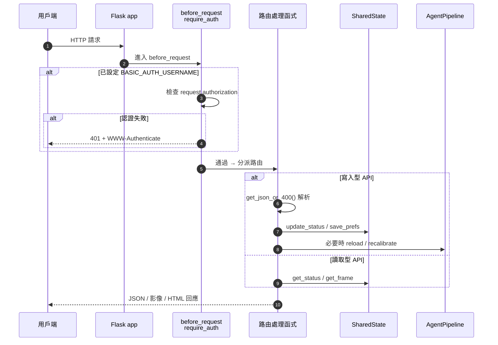

# 🔬 Internals：HTTP API 與請求生命週期

本文件列出 [`backend/stream_server.py`](../../backend/stream_server.py) 對外提供的所有 HTTP 端點，並說明一個請求從進入到回應所經過的處理流程。

> 回到 [進階技術細節索引](README.md) ｜ [文件中心](../README.md)

---

## 1. 請求生命週期 (Request Lifecycle)

每個請求都先經過 `@app.before_request` 的認證守門，再進入對應路由：



> 認證僅在 `--auth` 或對外開放（`--host 0.0.0.0` / `--enable-tunnel`）時啟用；本機預設 `127.0.0.1` 不強制認證。詳見 [隱私保護與資安](../privacy-and-security.md)。

---

## 2. 頁面路由 (HTML Pages)

| 方法 | 路徑 | 說明 |
| :--- | :--- | :--- |
| GET | `/` | 監控儀表板（`monitor.html`） |
| GET | `/camera` | 相機與技能／事件管理頁 |
| GET | `/skills` | 技能管理頁 |
| GET | `/events` | 事件管理頁 |
| GET | `/apps` | 應用啟動器 |
| GET | `/app/<filename>` | 載入單一網頁應用；`filename` 經 alnum 過濾防路徑穿越 |
| GET | `/mobile` | 手機副鏡頭推流頁（`MobileCamera.html`） |
| GET | `/tailwind.js` | 靜態資源 |

---

## 3. 即時影像 (Streaming)

| 方法 | 路徑 | 說明 |
| :--- | :--- | :--- |
| GET | `/live`、`/video_feed` | MJPEG 串流（`multipart/x-mixed-replace`），由 `generate_mjpeg_stream()` 以 ~30 FPS 推送 `SharedState.get_frame()`；無影格時回傳「CAMERA OFFLINE」佔位圖。 |
| POST | `/upload_frame?source=<id>` | 前端上傳 JPEG bytes；`cv2.imdecode` 解碼後寫入 `update_network_frame`。所有鏡頭（含本機）皆走此路徑。 |

---

## 4. 狀態與設定 (State & Settings)

| 方法 | 路徑 | 請求 / 回應 |
| :--- | :--- | :--- |
| GET | `/status` | 回傳完整 `DetectorStatus` + `local_ip` / `prefs` / `host_bind` / `has_network_stream` |
| GET | `/settings` | 回傳目前門檻、相機來源、翻轉設定 |
| POST | `/settings` | 以 `SettingsUpdate` 驗證 body；更新門檻／相機／隱私等並 `save_prefs` |
| POST | `/api/settings/update` | 直接寫入 prefs（泛用設定） |
| GET | `/cameras` | 列舉可用相機（macOS 透過 `system_profiler`，恆含 `phone`） |
| POST | `/control` | 以 `ControlCommand` 驗證；切換 `is_active`（暫停／恢復 AI） |
| POST | `/recalibrate` | 清空 `baseline_*` 並重新進入校準 |

---

## 5. 技能與事件 CRUD (Skills & Events)

| 方法 | 路徑 | 說明 |
| :--- | :--- | :--- |
| GET | `/api/skills` | 列出 `skills/*/config.json` |
| POST | `/api/skills/create` | 建立／更新技能目錄與 `config.json`，觸發 `action_engine.load_action_skills()` |
| POST | `/api/skills/toggle` | 切換 `enabled` 並 reload |
| POST | `/api/skills/delete` | `shutil.rmtree` 移除目錄並 reload |
| GET | `/api/events` | 列出 `events/*/config.json` |
| POST | `/api/events/create` | 建立／更新事件，觸發 `event_engine.reload()` |
| POST | `/api/events/toggle` | 切換 `enabled` 並 reload |
| POST | `/api/events/delete` | 移除事件目錄並 reload |
| GET | `/api/apps` | 掃描 `web/apps/*.html`，以正則解析 `<title>` 與 meta description |

> 所有名稱在落地為資料夾前都會經 `c.isalnum() or c in ('_','-')` 過濾，避免路徑穿越。

---

## 6. 輸入防護 (Input Hardening)

所有寫入型 JSON 端點皆透過 `get_json_or_400()` 統一解析：

```python
def get_json_or_400():
    data = request.get_json(silent=True)
    if not isinstance(data, dict):
        return None, (jsonify({"error": "Request body must be a valid JSON object"}), 400)
    return data, None
```

→ 空 body 或非 JSON 會得到乾淨的 **400**，而非未處理例外造成的 500。詳見 [隱私保護與資安 §2.3](../privacy-and-security.md)。

---

## 7. 相關文件

- 狀態如何被多執行緒安全讀寫：[Internals：狀態管理與並行模型](state-and-concurrency.md)
- 影格如何被產生：[Internals：Agent Pipeline 實作與生命週期](pipeline.md)
- 對外部署安全建議：[隱私保護與資安](../privacy-and-security.md)
