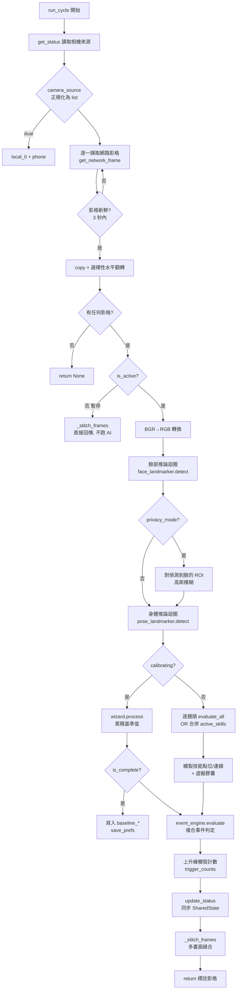
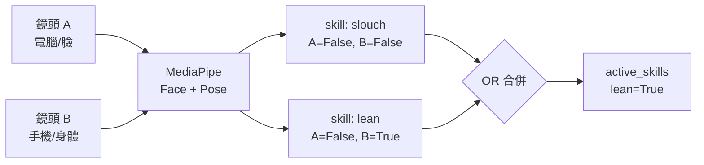

# 🔬 Internals：Agent Pipeline 實作與生命週期

本文件深入剖析 [`backend/core/pipeline.py`](../../backend/core/pipeline.py) 中 `AgentPipeline` 的內部實作，是理解 RenUniversal「一個影格如何從鏡頭走到判定結果」的權威參考。

> 回到 [進階技術細節索引](README.md) ｜ [文件中心](../README.md)

---

## 1. 角色定位

`AgentPipeline` 是中央協調器（Pipeline Pattern），被背景擷取執行緒以 ~30 Hz 反覆呼叫 `run_cycle()`。它串接四個子系統：

| 子系統 | 來源 | 職責 |
| :--- | :--- | :--- |
| `CalibrationWizardSkill` | `services/calibration_wizard` | 校準期蒐集 3 秒基準值 |
| `ActionEngine` | `core/action_engine.py` | 動態載入並評估 `skills/` 判定包 |
| `EventEngine` | `core/event_engine.py` | 將技能狀態組合成複合事件 |
| `FaceLandmarker` / `PoseLandmarker` | MediaPipe Tasks | 臉部 478 點與身體 33 點地標推論 |

---

## 2. 初始化 (`__init__`)

```text
載入 face_landmarker.task   → num_faces=1, 三項信心門檻 0.5
載入 pose_landmarker_lite.task → 三項信心門檻 0.5
建立 ActionEngine("skills") / EventEngine("events") / CalibrationWizardSkill
重置所有 baseline_* 與 previous_states / trigger_counts
```

> ⚠️ **效能注意**：MediaPipe Landmarker 以 **IMAGE 模式** 同步 `detect()` 呼叫，每影格每鏡頭各跑一次臉部與身體推論。這是目前單機延遲的主要來源（見 §7）。

---

## 3. `run_cycle()` 生命週期流程圖



---

## 4. 多鏡頭融合策略 (Multi-Camera Fusion)

系統將**所有**鏡頭源（本機與手機）統一視為「網路影格」——前端負責擷取並 `POST /upload_frame`，後端不直接開啟本機相機。這是刻意的設計，用以**規避 macOS TCC 權限封鎖與 Windows OpenCV 的相機 bug**。

融合邏輯（`run_cycle` 動作分析段）：

- **強制掃描**：對每個連線鏡頭都跑臉部與身體推論，不要求使用者指定哪台拍臉、哪台拍身體。
- **主鏡頭標定**：第一個偵測到臉的鏡頭成為 `face_frame_tuple`；第一個偵測到身體的成為 `pose_frame_tuple`。
- **OR 合併**：每個技能的觸發狀態跨鏡頭做邏輯 OR；metric 取各鏡頭最大值。任一鏡頭看到不良姿勢即視為觸發。



---

## 5. 校準 vs 動作分析的分支

`run_cycle` 依 `status.calibrating` 二選一：

| 階段 | 進入條件 | 行為 |
| :--- | :--- | :--- |
| **校準 Calibration** | `calibrating == True` | 將當前臉部／身體地標餵給 `wizard.process()`，累積基準距離與絕對座標；完成時寫入 `baseline_eye_distance`、`baseline_nose_chin_distance`、`baseline_shoulder_*`、`baseline_face_landmarks`、`baseline_pose_landmarks`，並 `save_prefs` 持久化。 |
| **動作分析 Action** | `calibrating == False` | 以基準值為 100% 對照，逐鏡頭呼叫 `ActionEngine.evaluate_all()`，OR 合併後更新 `active_skills` / `metrics`。 |

> 校準完成後所有判定都相對於這組基準；呼叫 `POST /recalibrate` 會清空 `baseline_*` 並重新進入校準。

---

## 6. 可視化繪製 (Annotation)

判定後 pipeline 直接在 BGR 影格上繪製（OpenCV）：

- **基礎追蹤點**：雙眼（綠）、鼻（藍）、下巴（紅）、雙肩，以及鼻–下巴參考線。
- **自訂技能點位／連線**：從每個 detector 的 `get_used_points()` / `get_point_pairs()` 取得；觸發時連線轉紅，監控時為綠／藍。
- **虛擬膠囊（`~~`）**：detector 在評估時填入 `capsules_to_draw`，pipeline 繪製雙獨立球體防護圈與切線；出界轉紅。
- **雙鏡頭分流**：以 `is_pose_id()` 判斷該點屬臉或身體，將其畫到對應的 `face_frame_tuple` 或 `pose_frame_tuple`。

---

## 7. 已知效能特性與優化點

| 特性 | 說明 |
| :--- | :--- |
| 每影格 2× 推論迴圈 | 臉部與身體推論分屬兩個 `for` 迴圈，可合併為單一迴圈走訪 `frames_rgb`。 |
| 多次影格 `copy()` | 擷取、翻轉、縫合各有複製；30 FPS 下累積可觀。 |
| 30 FPS 鎖定 | 擷取迴圈以 `time.sleep(1/30 - elapsed)` 對齊節奏（見 `stream_server.capture_loop`）。 |
| 規則每影格求值 | 每個 skill/event 每影格重跑正則替換 + AST 求值，規則多時可預編譯成 callable。 |

> 上述為設計取捨記錄，非缺陷；如需優化可從「合併推論迴圈」與「規則預編譯」著手。

---

## 8. 相關文件

- 規則如何被求值：[Internals：規則求值內部流程](rule-evaluation.md)
- 狀態如何跨執行緒同步：[Internals：狀態管理與並行模型](state-and-concurrency.md)
- 高層架構與數學公式：[系統架構與演算法](../DETAILED_ARCHITECTURE.md)
