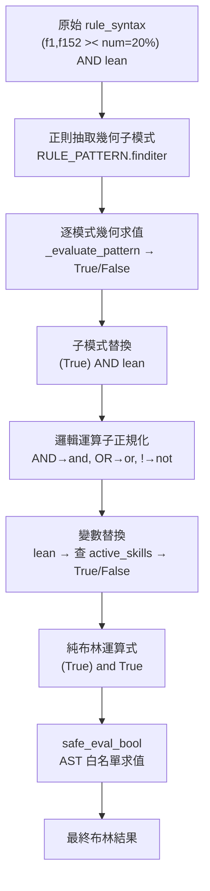
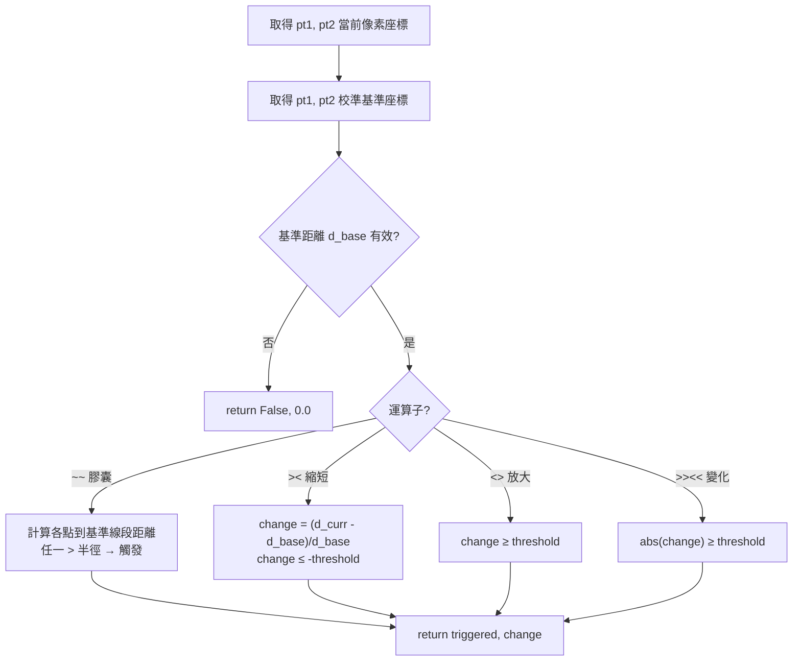
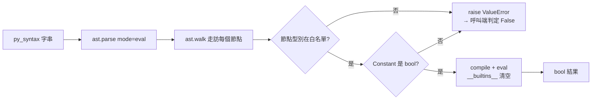

# 🔬 Internals：規則求值內部流程

[規則語法參考](../rule-engine.md) 面向「**寫規則的人**」；本文件面向「**讀程式的人**」，逐步拆解一條 `rule_syntax` 字串如何被轉換、求值成最終布林結果，對應 [`generic_skill_detector.py`](../../backend/core/generic_skill_detector.py)、[`event_engine.py`](../../backend/core/event_engine.py) 與 [`safe_eval.py`](../../backend/core/safe_eval.py)。

> 回到 [進階技術細節索引](README.md) ｜ [文件中心](../README.md)

---

## 1. 兩層求值器

| 層級 | 類別 | 輸入變數 | 角色 |
| :--- | :--- | :--- | :--- |
| 技能 Skill | `GenericActionDetector` | 幾何點位模式 | 將 `f1,f152 >< num=20%` 求值為單一布林 |
| 事件 Event | `EventEngine` | 技能名稱 + 幾何模式 | 將 `lean OR turn` 等組合求值 |

兩者共用同一套「**模式替換 → 邏輯正規化 → AST 安全求值**」流程。

---

## 2. 求值轉換管線 (Transformation Pipeline)

以事件 `(f1,f152 >< num=20%) AND lean` 為例：

### 各步驟對應程式碼

| 步驟 | 位置 |
| :--- | :--- |
| 幾何模式正則 | `RULE_PATTERN = r'([fp]?\d+)\s*,\s*([fp]?\d+)\s*(><|<>|>><<|~~)\s*num=(\d+(?:\.\d+)?)(%|px)?'` |
| 幾何求值 | `_evaluate_pattern()`（skill）／`evaluate_custom_pattern()`（event） |
| 邏輯正規化 | `re.sub(r'\bAND\b','and', ...)`、`replace('!',' not ')` |
| 變數替換 | event：查 `active_skills_dict`；skill：殘留字元一律 → `False` |
| 安全求值 | `safe_eval_bool(py_syntax)` |

---

## 3. 幾何模式如何判定 (`_evaluate_pattern`)

對一條 `pt1,pt2 OP num=N` 模式：

關鍵實作細節：

- **基準即 100%**：依使用者要求，已**移除動態遠近補償**——`scale = 1.0`，直接以校準當下的 `d_base` 為基準，轉頭距離縮短就是縮短，不被補償抵消。
- **百分比 vs 像素**：`num=N%` 會 `/100`；`num=Npx` 為絕對像素，且**不受**滑桿偏好覆寫（`pct_sign != 'px'` 才套用 `<name>_threshold` 偏好）。
- **膠囊（`~~`）副作用**：求值時順便把 `b1/b2/radius/triggered` 填入 `capsules_to_draw`，供 pipeline 繪製防護圈。

---

## 4. 安全求值器 (`safe_eval_bool`)

最終運算式只應包含 `True/False/and/or/not/括號`。`safe_eval_bool` 以 AST 白名單**強制**這一點：

白名單僅允許：`Expression`、`BoolOp`、`UnaryOp`、`And`、`Or`、`Not`、布林 `Constant`、`Load`。任何函式呼叫、屬性存取、算術、名稱參照都會被拒絕。

> 這取代了原本的 `eval(py_syntax, {"__builtins__": {}}, {})`——即使替換邏輯出現疏漏，殘留的惡意片段也無法執行。詳見 [隱私保護與資安 §2.1](../privacy-and-security.md)。

---

## 5. 失敗模式 (Fail-Safe Behavior)

| 情境 | 結果 |
| :--- | :--- |
| `rule_syntax` 無法解析出任何幾何模式 | 技能回傳 `(False, 0.0, {error})` |
| 點位未偵測到或基準缺失 | 該模式視為 `False` |
| 最終運算式含非法語法 | `safe_eval_bool` 拋 `ValueError`，呼叫端記 log 並判定 `False` |

整體採「**保守失敗**」原則：任何不確定狀況都傾向「不觸發」，避免誤報。

---

## 6. 相關文件

- 使用者面向的語法定義：[規則語法參考](../rule-engine.md)
- 求值結果如何進入狀態與計數：[Internals：Agent Pipeline](pipeline.md)
- 技能如何被載入與派發：[動作判斷包開發](../skills-development.md)
