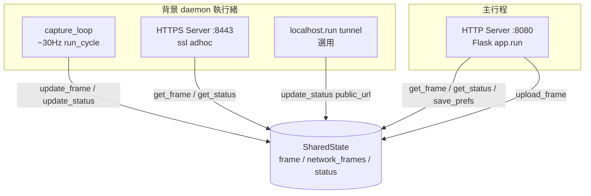
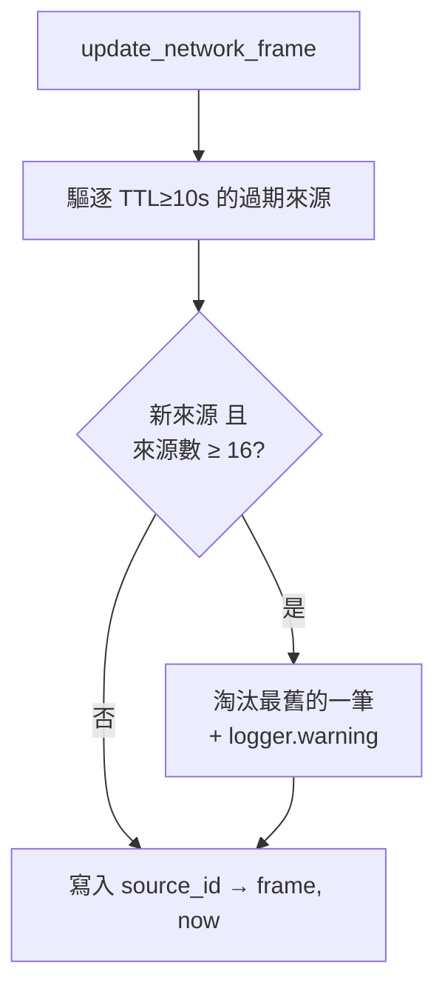

# 🔬 Internals：狀態管理與並行模型

本文件說明 [`backend/core/state.py`](../../backend/core/state.py) 的 `SharedState` 如何在多執行緒環境下安全地共享影像與狀態，以及 [`backend/stream_server.py`](../../backend/stream_server.py) 的執行緒拓撲。

> 回到 [進階技術細節索引](README.md) ｜ [文件中心](../README.md)

---

## 1. 執行緒拓撲 (Thread Topology)

伺服器啟動後同時存在多條執行緒，全部透過單一 `SharedState` 實例溝通：



| 執行緒 | 啟動點 | 角色 |
| :--- | :--- | :--- |
| HTTP Server | `app.run(host, 8080)`（主執行緒） | 提供儀表板、API、MJPEG 串流 |
| HTTPS Server | daemon thread，`ssl_context='adhoc'` :8443 | 供手機瀏覽器的 Secure Context |
| capture_loop | daemon thread | 驅動 `AgentPipeline.run_cycle()` |
| Tunnel | daemon thread（`--enable-tunnel`） | localhost.run 外網穿透 |

> CLI 模式（`--cli`）不啟動任何 Web 伺服器，`capture_loop(cli_mode=True)` 於主執行緒阻塞執行，並將觸發事件以 JSON 印至 stdout。

---

## 2. 三把鎖 (Lock Granularity)

`SharedState` 以**細粒度鎖**分離三類資料，避免單一全域鎖造成爭用：

| 鎖 | 保護對象 | 讀寫者 |
| :--- | :--- | :--- |
| `frame_lock` | `self.frame`（最新標註影格） | capture_loop 寫；MJPEG 串流讀 |
| `network_frame_lock` | `self.network_frames`（各鏡頭來源） | `/upload_frame` 寫；capture_loop 讀 |
| `status_lock` | `self.status`（`DetectorStatus`） | 所有 update/get、`save_prefs` |

所有跨執行緒存取都在鎖內進行，且 `get_*` 一律回傳 **copy / `model_copy()`**，讓呼叫端拿到快照、不持有共享參照：

```python
def get_status(self) -> DetectorStatus:
    with self.status_lock:
        return self.status.model_copy()
```

---

## 3. 網路來源生命週期與防護

`/upload_frame` 接受任意 `source` 參數，為避免惡意端以大量不同 `source_id` 撐爆記憶體（DoS），`update_network_frame` 在每次寫入時執行雙重防護：



讀取端 `get_all_network_sources()` 另以 3 秒新鮮度過濾「目前活躍」的來源，供 `/status` 回報 `has_network_stream`。

> 此防護為資安強化的一部分，詳見 [隱私保護與資安](../privacy-and-security.md)。

---

## 4. 偏好持久化與單位轉換 (`save_prefs`)

`save_prefs` 同時負責「更新記憶體狀態」與「持久化至 `preferences.json`」，並處理百分比／比例的雙向換算：

| 概念 | 狀態欄位（百分比） | 持久化欄位（比例） |
| :--- | :--- | :--- |
| 低頭門檻 | `threshold` = 20.0 | `threshold_ratio` = 0.20 |
| 偏轉容差 | `yaw_tolerance` = 10.0 | `yaw_tolerance` = 0.10 |

關鍵設計：

- **滑桿類門檻不落地**：寫檔時排除 key 含 `threshold` / `tolerance` 的項目（`memory-only tuning`），讓滑桿微調僅存在於當前 session，不污染長期偏好。
- **`<= 1.0` 啟發式**：以數值大小推測輸入是比例（≤1）或百分比（>1）。這是已知的脆弱點——數值剛好為 1 時語意模糊，調整 UI 時需留意。

> 持久化的 `preferences.json` 含個人化基準，已列入 `.gitignore`。

---

## 5. 強型別狀態模型 (`DetectorStatus`)

狀態以 Pydantic 模型 [`schema.py`](../../backend/core/schema.py) 定義（Strongly Typed I/O）。每次 `update_status` 都會以 `model_dump()` → 合併 → 重建模型，確保任何寫入都通過型別驗證：

```python
def update_status(self, **kwargs):
    with self.status_lock:
        current = self.status.model_dump()
        current.update(kwargs)
        self.status = DetectorStatus(**current)   # 重新驗證
```

`active_skills` / `active_events` / `metrics` / `trigger_counts` 皆為動態 dict，反映運行時載入的技能，不在 schema 寫死任何技能名稱——這是系統高通用性的根基。

---

## 6. 優雅關閉 (Graceful Shutdown)

`stream_server` 註冊 `SIGINT` / `SIGTERM` 處理器，收到訊號時呼叫 `pipeline.stop()` 釋放相機資源後 `sys.exit(0)`；`start.py` 啟動器則在 `KeyboardInterrupt` 時送 `SIGTERM` 並等待至多 5 秒，逾時才強制 `kill`。

---

## 7. 相關文件

- 影格如何被產生與標註：[Internals：Agent Pipeline 實作與生命週期](pipeline.md)
- API 如何讀寫狀態：[Internals：HTTP API 與請求生命週期](http-api.md)
